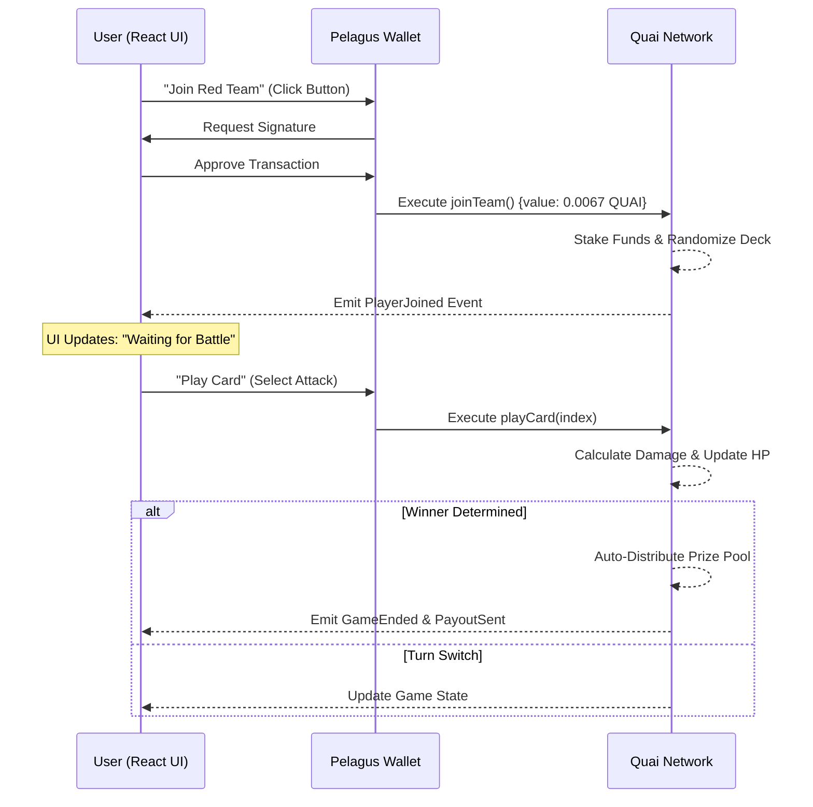

# ⚔️ Quai Battle: The Atomic Card War

**[PLAY NOW LIVE 🚀](https://quai-card-game-vibrecraft26.vercel.app/)**

**Quai Battle** is a real-time, high-stakes team strategy game running entirely on the **Quai Network**. It demonstrates the power of atomic, low-latency blockchain interactions by pitting two factions (Red vs. Blue) against each other in a relentless tug-of-war for dominance.

Unlike traditional card games where assets are static, **Quai Battle** is dynamic: players stake real QUAI to join, their decks are cryptographically randomized by the chain, and the spoils of war are automatically distributed to the victors via smart contracts.

---

## 🏗️ Architecture

The game leverages a decentralized architecture ensuring fairness and immutability.



---

## 🛠️ Tech Stack

*   **Blockchain**: Quai Network (Orchard Testnet / Cyprus-1)
*   **Smart Contract**: Solidity `^0.8.0` (Hardhat)
*   **Frontend**: React.js, Vite
*   **Styling**: Tailwind CSS (Glassmorphism & Game UI best practices)
*   **Interaction**: `quais.js` (Ethers v6 compatible) implementation for Quai
*   **Icons**: Lucide React

---

## ✨ Features

### 1. ⚖️ Atomic Team Balancing
The contract enforces fairness using an LCM (Least Common Multiple) algorithm.
*   If **1 player** fights **3 players**, the lone wolf receives **15 cards**, while the trio receives **5 cards each**.
*   Total damage potential stays balanced, ensuring skill and strategy matter more than numbers.

### 2. 💰 High-Stakes Betting Pool
*   **Pay-to-Play**: Every soldier pays a **0.0067 QUAI** entry fee.
*   **The Pot**: All entry fees go into a locked smart contract vault.
*   **Winner Takes All**: The moment a team wins, the contract *automatically* splits the total pot among the winning team members and sends it directly to their wallets. No claiming required.

### 3. 🛡️ Faction System
*   **Red vs. Blue**: Choose your allegiance.
*   **Shared Health**: You aren't just fighting for yourself; you share a global Team HP bar. Collaborative survival is key.

### 4. ⚡ Instant "Mercy" Logic
The contract detects "Total Domination". If one team runs out of cards while the other is fully armed, the game ends immediately to save gas and time.

---

## 🚀 Why Play? (The Vision)

Quai Battle isn't just a game; it's a **blueprint for the future of decentralized coordination**.

*   **Proof of Concept for DAOs**: It proves that groups of strangers can pool funds, coordinate actions (turns), and share rewards trustlessly.
*   **Adrenaline**: Real crypto is at stake. Every card you play costs gas and impacts your potential return on investment.
*   **Speed**: Built on Quai, the transactions are faster and cheaper than traditional L1s, making real-time turn-based logic viable.

---

## ⚙️ Setup & Reproducibility Instructions

### 1. Prerequisites
*   Node.js (v18+)
*   Git
*   **Pelagus Wallet** installed in your browser.

### 2. Clone the Repository
```bash
git clone https://github.com/uncle-droy/quai-card-game-vibrecraft26.git
cd quai-card-game-vibrecraft26
```

### 3. Install Dependencies
```bash
# Contract Setup
npm install

# Frontend Setup
cd frontend
npm install
cd ..
```

### 4. Deploy Smart Contract
Create a `.env` file in the root with your Private Key:
```env
PRIV_KEY="your_private_key_here"
```

Compile and Deploy:
```bash
npx hardhat compile
node scripts/deploy.js
```
*Note: This script automatically updates the frontend with the new Contract Address and ABI.*

### 5. Run Frontend
```bash
cd frontend
npm run dev
```
Open `http://localhost:5173` to play!

---

## 🔮 Future Improvements

1.  **Multi-Lobby System**: Upgrade the contract to support thousands of concurrent matches. Players would generate a unique "War Code" (Lobby ID) to invite friends into private, isolated battlegrounds on-chain.
2.  **NFT Integration**: Mint special "Commander" cards as NFTs that give passive bonuses (e.g., +10 Team HP).
3.  **Chat System**: On-chain or encrypted P2P chat for team coordination ("Use your Fireball now!").
4.  **Tournaments**: Automated bracket system where winning teams advance to fight other winning teams for a Mega Pot.
5.  **Governance**: Allow top players to vote on game balance changes (nerfing specific cards).

---

### 🏆 Built for **Vibecraft 2026 Hackathon**
_Crafting the future of decentralized vibes on Quai Network._
